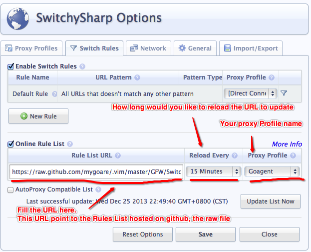
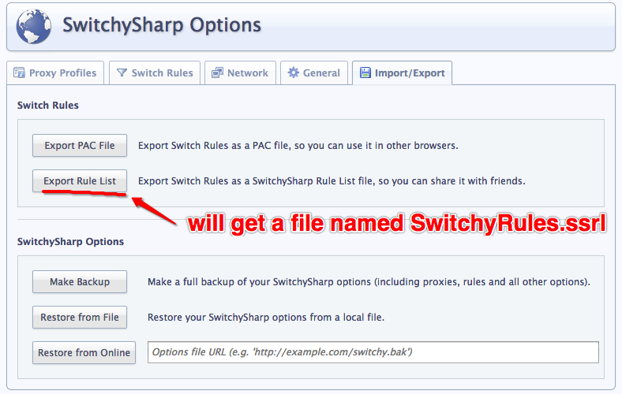

###What you need

You need:

* [Goagent](https://code.google.com/p/goagent/)

    a gae proxy forked from gappproxy/wallproxy

* [Switchysharp](https://code.google.com/p/switchysharp/)

    Chrome Proxy Setting Extension

* SwitchyOptions.bak

    It is the file I backup the basic SwitchySharp Options settings. It usually can be used to initialize the settings if you are new to SwitchySharp.

    If you are already using SwitchySharp, you can ignore it.

###What it is

It is a rules list of switchysharp extension. Something similar to [autoproxy-gfwlist](https://code.google.com/p/autoproxy-gfwlist/), but it is my own summary.

###How to use

The URL is: https://raw.github.com/mygoare/.vim/master/GFW/SwitchyRules.ssrl

###How to contribute

It is simple to contribute.

Go to the `SwitchySharp Options` and switch to `Import/Export` tab. Export to Rule List.

After you get the file**(same name with it in the folder)**, diff with file with me, then you can have your pull request.
